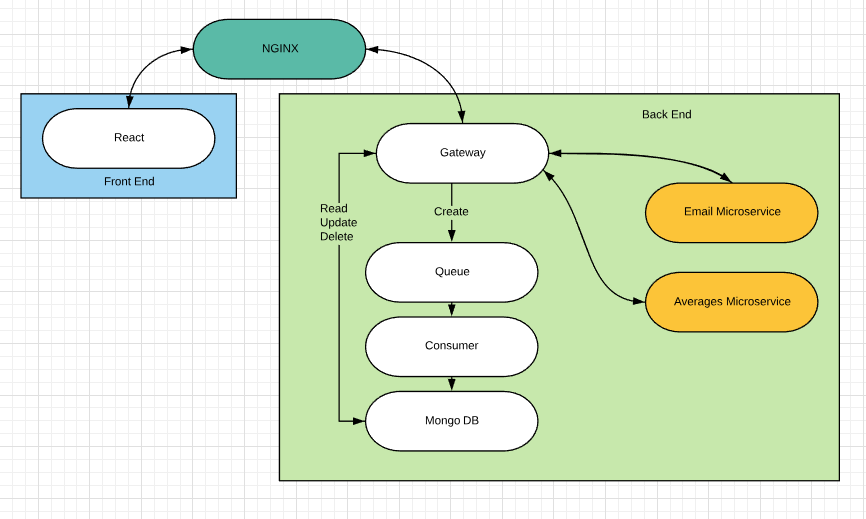

## Contributors
* [Jordan Hignett](https://github.com/JHignett1995): CI/CD
* [George Downe](https://github.com/geodow06): Front End
* [Thomas Scowcroft](https://github.com/scowy): Front End
* [Valentin Lukovski](https://github.com/VLukovski): Back End
* [Jonathan Eures](https://github.com/JEuresQA): Back End

## Index
1. [Project Definition](#1-Project-Definition)

2. [Architecture](#2-Architecture)
     
3. [Containers](#3-Containers)
   * [NGINX](#NGINX)
   * [React Front End](#React-Front-End)
   * [Gateway](#Gateway)
   * [Email Microservice](#Mail)
   * [Averages Microservice](#Averages)
   * [ActiveMQ](#ActiveMQ)
   * [Queue Consumer](#Queue-Consumer)
   * [MongoDB](#MongoDB)
     
4. [Testing](#4-Testing)
   * [Unit Testing](#Unit-Testing)

5. [How To Run](#5-How-To-Run)
   * [Prerequisites](#Prerequisites)
   * [Steps](#Steps)

6. [Continuous Integration](#6-Continuous-Integration)
   * [Docker](#Docker)
   * [Jenkins](#Jenkins)
   
7. [Repositories](#7-Repositories)

# 1. Project Definition
Trainees should be able to log in to submit a self-reflective feedback form on a weekly basis. Trainers should be able to log in and add trainees to specific cohorts to group them as well as view feedback submited and overall data on trainees and cohorts.

# 2. Architecture

Each white box in the diagram is a docker container

# 3. Containers
## NGINX
NGINX handles routing the user to the front end and routing the front end requests to the Gateway API. It also redirects all traffic to HTTPS to implement SSL for all connections.

## React
[ReactJS](https://reactjs.org/) has been used to build the front end for the app. It utilises a single page with routes to direct to the various views in the app.

## Gateway
The gateway receives all requests from the front end and redirects it to the correct microsevice.

## Mail
The mail microservice performs the service of sending feedback as an email from a trainer to a trainee.

## Averages
This performs the neccessary equations to provide data to be used in a presentable manner

## ActiveMQ
[ActiveMQ](http://activemq.apache.org/) queues requests from the APIs that are trying to persist data to the database.

## Queue Consumer
This microservice listens to the queue and sends any requests in the queue to the database.

## MongoDB
[MongoDB](https://www.mongodb.com/) stores all the data for the app.

# 4. Testing
## Unit Testing
[Mockito](https://site.mockito.org/) has been used to unit test the interactions with the database. These tests can be seen in the repos of the microservices.

# 5. How To Run
## Prerequisites
* [Docker](https://hub.docker.com/search/?type=edition&offering=community)
* [Docker Compose](https://github.com/docker/compose/releases)
* A Shell Terminal

## Steps
1. Clone this repo using the set-repo-to-george branch
3. Run the install.sh script

# 6. Continuous Integration
## Docker
Having all the microservices in [Docker](https://www.docker.com/) containers makes the app more portable. The containers being in a docker network allows the various microservices to communicate without being exposed to external access.

## Jenkins
[Jenkins](https://jenkins.io/) pipelines have been used to automate building, testing and deploying all the microservices whenever changes are made to the master Git branch.

# 7. Repositories
* [Front End](https://github.com/geodow06/feedback-forms-front)
* [Gateway API](https://github.com/geodow06/feedback-forms-gateway)
* [Mail Microservice](https://github.com/geodow06/feedback-forms-mail.git)
* [Averages Micro Service](https://github.com/geodow06/feedback-form-average.git)
* [Queue Consumer](https://github.com/geodow06/feedback-forms-consumer)
